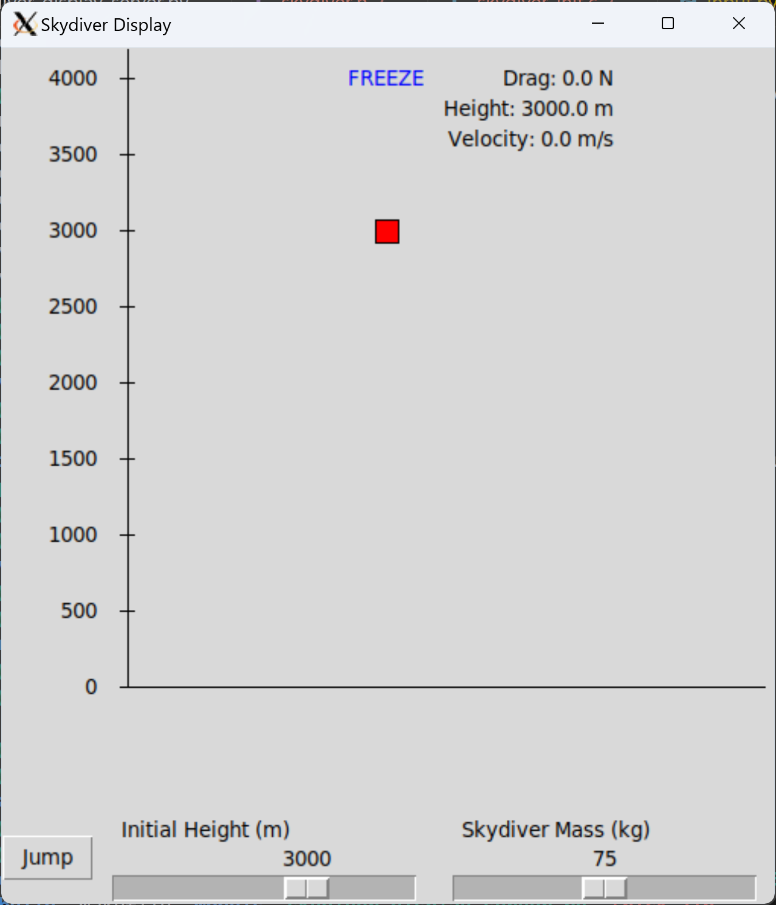

# Skydiver Simulation
A graphical realtime simulation model of a skydiver with aerodynamic drag using the NASA Trick simulation framework.
Note: This simulation only takes into account the force of gravity and the aerodynamic drag. Changes in Air Density with altitude were not accounted for in this simulation.


## Requirements
- Trick simulation framework. Click [here](https://nasa.github.io/trick/) for more information.
- Linux environment

## Running the simulation

# Compile the simulation
Read documentation on how to compile the simulation [here](https://nasa.github.io/trick/documentation/install_guide/Install-Guide).
Then at the root directory of the simulation, run:
```bash
trick-CP
```
# Run the simulation with input file
```bash
./S_main_Linux_13.2_x86_64.exe RUN_test/input.py
``` 
Simulation can be run directly from Python GUI by pressing the 'Jump' Button. Also, initial conditions can be set in GUI (Initial Height (m) and Mass (kg)).
Note: Skydiver's Python GUI uses Trick's Variable Server. See [here](https://nasa.github.io/trick/tutorial/TutVariableServer) for more information.

#

<div align="center">
  
</div>

*Skydiver's Python GUI using Trick's Variable Server*